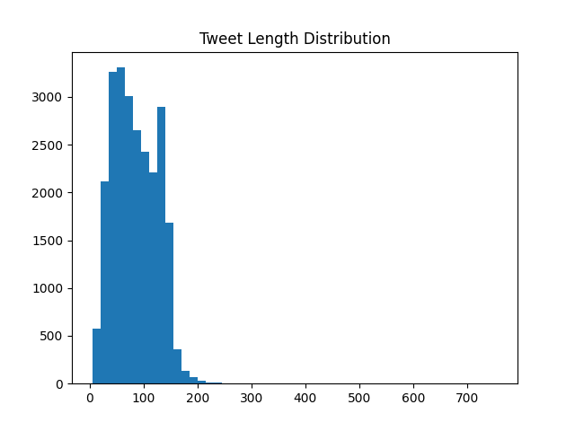
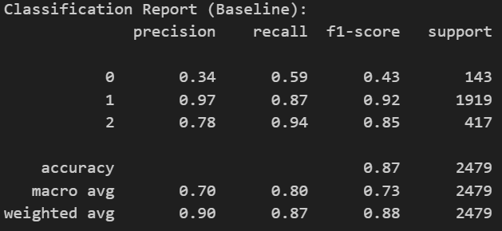
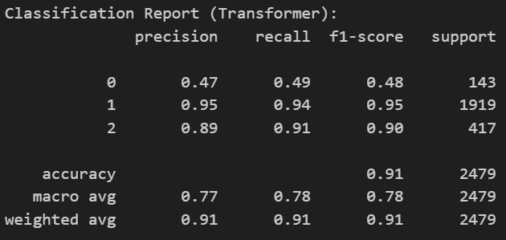

# Mini Project XI - NLP Application: Content Moderation with Transformers
BCIT Master of Science - Applied Computing : COMP 9130 - Applied Artificial Intelligence Mini Project 9

## Problem Description
SafeSpace AI focuses on the difficult task of moderating social media content automatically. The main technical challenge is separating Hate Speech (5.8%) from general Offensive Language (77.4%). This is hard because hate speech is rare in the data (class imbalance), and Twitter users often use slang, sarcasm, or context-specific insults. Comparing a simple TF-IDF baseline with the DistilBERT transformer model to show the effectiveness of transformer models in NLP tasks.

## Dataset description
Source Link: https://raw.githubusercontent.com/t-davidson/hate-speech-and-offensive-language/master/data/labeled_data.csv

The dataset is the Twitter Hate Speech and Offensive Language Dataset (Davidson et al., 2017), containing 24,783 tweets. It has three classes with severe imbalance:
- Hate (0): ~5.8% (1430)
- Offensive (1): ~77.4% (19190)
- Neither (2): ~16.8% (4163)

Most text is noisy (slang, abbreviations, URLs, @mentions, hashtags).

Most tweets are around 100 words.
## Results summary: baseline vs transformer comparison table

There is 5% improvement from baseline to transformer model.
## Setup instructions
    git clone https://github.com/CA-JunPark/mini-project-9.git
    cd mini-project-9
    python -m venv .venv
    source .venv/Scripts/activate or .venv/bin/activate
    pip install -r requirements.txt

run .ipynb files with a created python environment.

if torch is not compatible with the system, uninstall it first:
    pip uninstall torch torchvision 
then https://pytorch.org/get-started/locally/ to install the correct version.

## Team Member Contributions
Group 10

Aristide: Initial setup for model training

Jun: Tuning and evaluation of the model

Together: Learning Hub Report